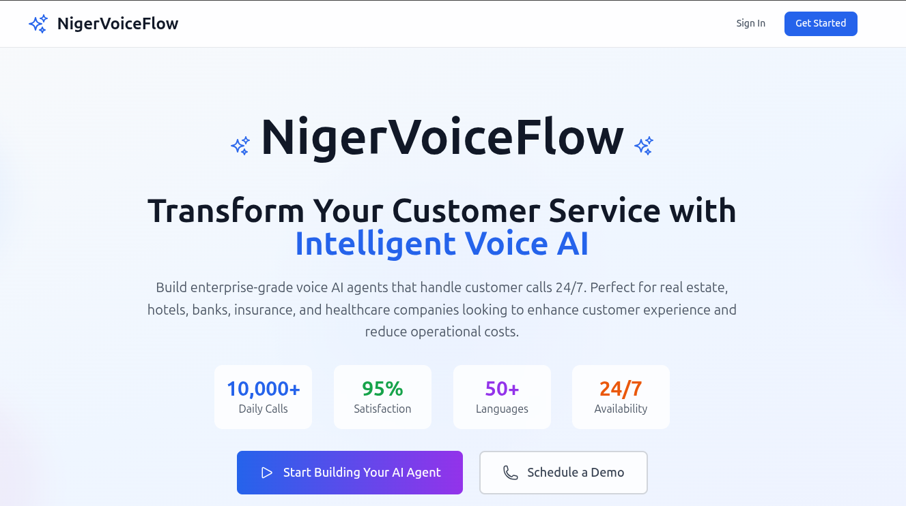
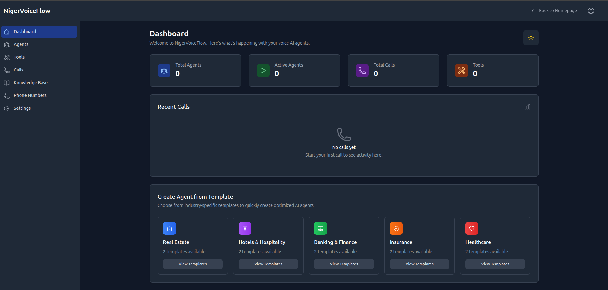

<p align="center">
  
</p>

<h1 align="center">AI Call Agent </h1>
<p align="center">
  <b>A modern React-based application designed to manage AI-powered voice agents, oversee call operations, configure tools, and organize knowledge resources.</b>
</p>

<p align="center">
  
  
  
</p>

---

## 🚀 Features

- 📊 **Dashboard**: Overview with statistics and recent activity
- 🤖 **Agents Management**: Create, edit, and manage AI voice agents
- 📞 **Calls Management**: Initiate and monitor voice calls
- 🛠️ **Tools Management**: Configure and manage tools for agents
- 📚 **Knowledge Base**: Manage documents and FAQs
- ☎️ **Phone Numbers**: Manage phone number assignments
- 📱 **Responsive Design**: Works on desktop and mobile devices

---

## 🖼️ Screenshots

<p align="center">
  
  <br/>
  <i>Landing Page</i>
</p>

<p align="center">
  
  <br/>
  <i>Dashboard Overview</i>
</p>

<p align="center">
  
  <br/>
  <i>Agents Templates</i>
</p>

---

## 🛠️ Technology Stack

| Technology         | Description                |
|--------------------|---------------------------|
| React 18 + TS      | Frontend framework        |
| React Router       | Routing                   |
| Tailwind CSS       | Styling                   |
| Heroicons          | Icons                     |
| Axios              | API communication         |
| React Hook Form    | Form management           |

---

## ⚡ Getting Started

### Prerequisites

- Node.js 18+
- Backend API running

### Installation

```bash
cd call_agent_frontend
npm install
```

### Configuration

Create a `.env` file:
```env
REACT_APP_API_URL=http://localhost:8000
```

### Start Development Server

```bash
npm start
```

Open [http://localhost:3000](http://localhost:3000) in your browser.

---

## 📁 Project Structure

```text
src/
├── components/          # React components
│   ├── Layout.tsx      # Main layout with navigation
│   ├── Dashboard.tsx   # Dashboard overview
│   ├── Agents.tsx      # Agents management
│   └── Calls.tsx       # Calls management
├── services/           # API services
│   └── api.ts         # API client and types
├── App.tsx            # Main app component
├── index.tsx          # App entry point
└── index.css          # Global styles
```

## Available Scripts

- `npm start` - Start development server
- `npm run build` - Build for production
- `npm test` - Run tests
- `npm run eject` - Eject from Create React App

## Development

### Adding New Components

1. Create a new component in `src/components/`
2. Add the route in `src/App.tsx`
3. Update the navigation in `src/components/Layout.tsx`

### Styling

The project uses Tailwind CSS with custom components defined in `src/index.css`. Common classes:

- `.btn-primary` - Primary button styling
- `.btn-secondary` - Secondary button styling
- `.btn-danger` - Danger button styling
- `.card` - Card container styling
- `.input-field` - Form input styling

### API Error Handling

The API service includes automatic error handling:
- 401 errors redirect to login
- Network errors are logged to console
- Form validation errors are displayed to users
---

## 🤝 Contributing

1. Follow the existing code style
2. Add TypeScript types for new features
3. Test your changes thoroughly
4. Update documentation as needed

---

## 📝 License

This project is part of the AI Call Agent platform. See the main project README for license information.
